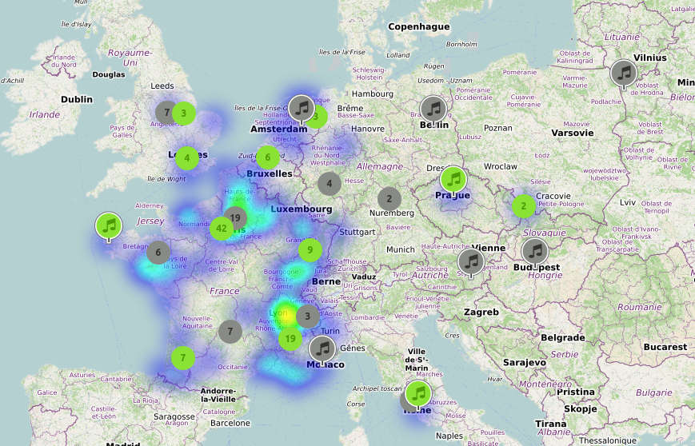

# OpenPianosMap

## Overview

The goal of this project is to create an open source map of accessibles pianos (freely or not).
Data will be hosted on OpenStreetMap.

For the moment, the project is "just" a filter defined on [MapContrib](https://github.com/MapContrib/MapContrib).

The map is here :
https://www.mapcontrib.xyz/t/e5c83c-OpenPianosMap

For a mobile Android app, you can use the great OpenMultiMaps available [on F-droid](https://f-droid.org/packages/app.fedilab.openmaps), then go to contributions -> mapcontrib

## How to add a piano ?

I suggest to tag piano this way: create a node with this tags:

  - `amenity=piano`
  - add access details:
    - `access=yes`: explicitly public and open to whoever
    - `access=permissive`: while nominally private, no visible attempt is made to restrict access, and casual use appears to be tolerated by the owners
    - `access=customers`: while open to the public, the clear policy is to require a purchase prior to use.
  - add piano type: "real" piano or electronic piano ?
    - `musical_instrument=piano`: a "real" piano (with strings and hammers)
    - `musical_instrument=digital_piano`: an electronic piano
  - is it a SNCF piano in a trainstation ? Then add:
    - `operator=SNCF`
  - is the position estimated ? Then add:
    - `fixme=position`
  - to make clear you followed this guide, you can add:
    - `note=https://github.com/brunetton/OpenPianosMap`
  - if you read the piano existence information somewhere, you can link the source:
    - `source=http://somewhere/on/the/internet` (see [this node for example](https://github.com/brunetton/OpenPianosMap))

### Add a photo ?

If you want to take a picture of the piano (what a **great idea !**), put it somewhere on the internet (https://www.mapillary.com/ or https://www.openstreetcam.org/ seems to be good places for that).

#### Set GPS coordinates

Pianos are often indoor; and gps can be unable to fix. In that case, we'll have to manually set GPS coords of images:

    exiftool -overwrite_original -GPSLatitude="48.8926936" -GPSLongitude="2.239364" *.jpg

#### Upload photo

- uploading to Mapillary is really simple and can be done from website.
- uploading from OpenStreetCam is not so easy. See [here](openstreetcam-howto.md) how to upload to OpenStreetCam (using command line)

#### Add tags to node

  - for Mapillary:
    - `image=https://www.mapillary.com/map/im/<mapillary_image_key>`
    - `mapillary=<mapillary_image_key>` (image key is given on image details on website)
  - for OpenStreetCam:
    - `image=https://www.openstreetcam.org/details/959557/2` (to adapt to each photo, of course)

Example: [this piano node have photos](http://www.openstreetmap.org/node/5175455028) (OpenStreetCam and Mapillary).

=> read more about photo linking is OSM [in OSM Wiki](https://wiki.openstreetmap.org/wiki/Photo_linking)

## Tags used

  - for free access pianos (**green** on map):
    - nodes with `amenity=piano`
    - nodes with `musical_instrument=piano`
    - nodes with `musical_instrument:piano=yes`
    - with:
      - `access=yes`
      - **or**
      - `operator=SNCF`

  - for other pianos (**gray** on map): Same as above, but without `acess=public` or `operator=SNCF` tags

(overpass requests used to populate map are located in `overpass-requests` folder)

## Tags stats

Here is a taginfo link to compare usage of:
  - musical_instrument=piano
  - amenity=piano
  - musical_instrument:piano=yes

https://taginfo.openstreetmap.org/compare/musical_instrument=piano/amenity=piano/musical_instrument:piano=yes/

## TODO

This are informations to add via OSM tags

### Add more access infos

For the moment, there's no way to distinguish a bar with a place with a piano freely accessible and a place with a piano, but only reserved for concerts for example.
As the aim of the project is to quickly find on a map freely accessible pianos, it's an important point to decide.

What not using [access](http://wiki.openstreetmap.org/wiki/FR:Key:access) tag as it's used by the [toilets](http://wiki.openstreetmap.org/wiki/Tag:amenity%3Dtoilets) tag ?
For me its make sens to see:

  - *access=yes* explicitly public and open to whoever.
  - *access=permissive* while nominally private, no visible attempt is made to restrict access, and casual use appears to be tolerated by the owners.
  - *access=customers* while open to the public, the clear policy is to require a purchase prior to use. You may need a key or code to get in. Some people also use access=destination for this.

Of course, all that tags should only be used for nodes, not ways.

I'll make a proposal when it's more clear for me.

### Identify "real" pianos

It's always usefull to know whether a piano is a real one or a digital one.
For it we could use :
  - musical_instrument=piano
  - musical_instrument=digital_piano

### ~~Add all *pianos en gare* French project~~

~~The "pianos en gare" is a French project by the french railway service (SNCF) to place pianos in railways stations: http://www.sncf.com/fr/presse/carte/pianos-gares.
`operator=SNCF` is generally filled~~  => done (66 pianos added)

### Add infos when clicking

This is inherent to MapContrib evolutions, but it could be great to have some infos when clicking on a piano on the map:
  - place name
  - photo (if any)
  - "advanced" link to display all tags

=> See https://gitlab.com/mapcontrib/mapcontrib.next/-/issues/1
